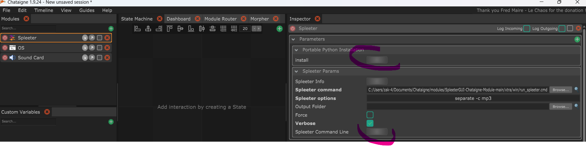

[](http://benjamin.kuperberg.fr/chataigne/en)

# SpleeterGUI-Chataigne-Module

**Spleeter GUI** by Chataigne. Deezer separation tool &amp; models

**GUI Front end for Spleeter - AI source separation**


This project will make it easy for users to run Spleeter without needing to use the command line tools to do so.
Built-in Chataigne audio feature will provide you all necessary to see/test the result with few clicks. 
You should be able to hear the song without bass, drums , vocals etc ...or only one of them.

This should work on all OS where Chataigne/Spleeter are supported (Win/macOS/Linux...)

Windows / Linux / Mac users can have it running in few minutes.
> You do not need to install python or spleeter, this is a portable version of python pre-loaded with spleeter.

### *** Videos DEMO ***

https://user-images.githubusercontent.com/121941293/219706114-4a899a6c-35b6-47ac-8f9e-27b58ce189e4.mp4
> 2 stems


https://user-images.githubusercontent.com/121941293/219708676-e8038fb5-9c48-4f2e-ab5a-a6f25eb83d60.mp4
> 5 stems

### *** Prerequest for Manual installation ***
Need python 3 (3.10.x x64)/ spleeter & tensorflow modules / ffmpeg

```
pip3 install numpy==1.26.3
pip3 install spleeter==2.4.0
```
> Spleeter : https://github.com/deezer/spleeter/wiki/1.-Installation
should install required python modules

see this for ffmpeg:
> ffmpeg download : https://ffmpeg.org/download.html

Win user can use winget:
> winget install ffmpeg
>


For Win/Linux/Mac users, portable version has been setup with all prerequest (except ffmpeg).
> 
>[Python Portable version with Spleeter module](https://github.com/zak-45/SpleeterGUI-Chataigne-Module/releases/tag/0.0.0.0)


### ***Installation :***

Manual
```
Copy this repository to :
<MyDocuments>/Chataigne/modules/SpleeterGUI-Chataigne-Module-main

```
From Chataigne
```
 Use module manager
 Click on install to download SpleeterGUI chataigne module
```


```
On Portable Python Installation:
 Click on install to download Spleeter Python Portable.
 Once done, you can use the Spleeter Command-line to open a Terminal and execute any spleeter command.

```



### ***Use it :***

```
Open  Chataigne.

Go to Modules, right click, Custom, Spleeter.
```


```
To install Python Portable with spleeter module, use the Install button if not already done.
This will do the necessary steps to put on your system a running spleeter python module

zip file available for Win / Linux x86_64 / MacOS universal2

```


```
On Inspector:
	Spleeter command: command to execute
		This is the full path for the command to launch. Need to be adapted to your needs/ installation.
		Default command adapted to python portable version:
		    xtra/win/run_spleeter.cmd for Win
		    xtra/mac/run_spleeter.sh for Mac 
		    xtra/linux/run_spleeter.sh for Linux		                
	Spleeter options : options to pass to the command
		Options that will be passed to the executed command.
	OutputFolder :Folder where to store separate audio tracks
		This one will store the separate audio file output
		If left blank, will be set to audio_output under temp location.
	Force : force command execution
		To optimize the process, SpleeterGUI will check if an already separation file exist and re-use it
		This parameter will force spleeter to execute and overwrite existing files.
	Verbose : provide more informations during running command.
```


```
On Command Tester, Spleeter: all SpleeterGUI available commands.
	separate : execute the command / options set in Parameters for audio track separate
		* sequence : audioclip file path from an existing sequence (with audio file enveloppe)  . Take in priority if set.
		* file : mp3 audio file name.
		* Model to use : select 2 / 4 or 5 stems
```


```
 Example after a 5 stems execution:
```


### -- INFO --
Each first time you select stem separation, this will automatically download required model if not exist.

Spleeter is CPU intensive: on Intel(R) Core(TM) i5-8300H CPU @ 2.30GHz   2.30 GHz, need 70 seconds to separate 3'30" audio track.
Second run should be faster anymore.

Not all spleeter features has been implemented. Focus has been set to the separate. SpleeterGUI need a mp3 file as input and produce mp3 files as result. 

All others commands can be executed by using spleeter command line if necessary.

Spleeter WIKI : https://github.com/deezer/spleeter/wiki/2.-Getting-started

```
If you want the look and feel of the first screenshots, just use the spleeter.noisette file and the spleeter_bg.png provided.

```
